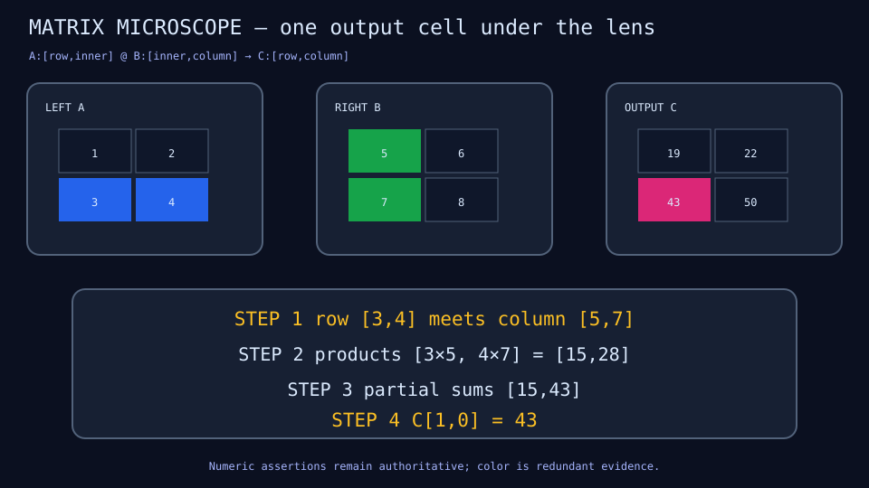
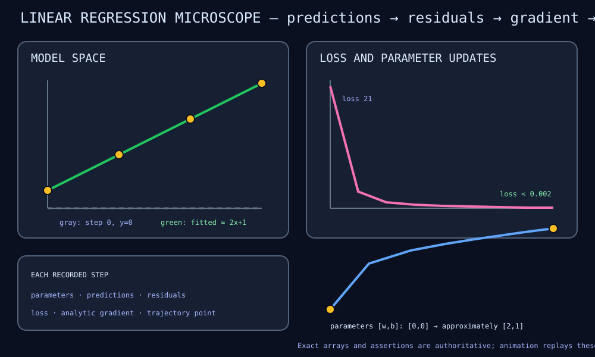

# demo-ml-microscope

Executable sw-MLPL lessons that expose semantically named intermediate values
as a recorded timeline. The goal is an ML microscope: read the algorithm in
MLPL, change it, run it, and inspect how arrays, parameters, gradients, and
metrics evolve without replacing the lesson with a bespoke Rust simulator.

The project starts from current public sw-MLPL behavior. In particular,
`emit_frame(name, step, value)` already streams a whole numeric tensor and
returns that value unchanged. The first implementation milestone will test how
far a small MLPL facade over that primitive can go before requesting any core
or native work.

## Ownership boundary

- This repository owns ML concepts, lesson sequencing, observation names,
  explanations, numeric evidence, and `.mlpl` applications.
- [`demo-mlpl-libraries`](../demo-mlpl-libraries) is the future home for a
  domain-neutral observation helper only after three unrelated lessons prove
  its API. This repository will then consume a revision-pinned vendored copy.
- [`demo-extensions`](../demo-extensions) is the future home for the preferred
  full-featured Rust/Yew WASM microscope. Its existing native graphics support
  may later provide optional desktop/3-D views. Neither renderer may contain
  algorithm-specific visualizers.
- [`sw-mlpl`](../sw-mlpl) should change only for measured language-wide gaps,
  such as a versioned frame protocol or generic browser Explorer host that
  cannot be expressed downstream.

Sibling repositories are read-only from this project. Exact work requests and
acceptance criteria are recorded in
[`docs/cross-repo-handoffs.md`](docs/cross-repo-handoffs.md).

## Planned learning path

The first three forcing-function lessons are deliberately different:

1. matrix multiplication for concept-by-concept stepping;
2. linear regression for iterative parameters, gradients, and metrics;
3. K-means for named assignment/update phases.

## First visual microscope

MM01 is now executable. It follows one output cell from its selected row and
column through component products and partial sums, then compares the complete
derived matrix with native `matmul`.



```sh
just matrix             # run MLPL and check the generated visual
just matrix-recording   # prove live SSE equals the Yew fixture
```

Read the [MM01 lesson guide](docs/matrix-microscope.md) or inspect the
[standalone MLPL source](demos/matrix_microscope.mlpl). The committed
[recording fixture](fixtures/yew/matrix-run-v0.json) is the first integration
input for the planned Rust/Yew viewer in `demo-extensions`.

See [graphics and animation options](docs/graphics-options.md) for the Yew,
CSS, SVG, GIF, WebP, video, native-renderer, README, and accessibility decisions,
including exact commands for viewing the current deliverable.

## Gradient descent microscope

LR01 exposes an entire two-parameter learning loop: predictions, residuals,
mean squared loss, analytic gradient, parameters, and trajectory. Eight updates
fit four exact points on `y=2x+1`; five bounded checkpoints are retained for
playback.



```sh
just regression             # run MLPL and check the generated visual
just regression-recording   # prove live SSE equals the Yew fixture
```

Read the [LR01 lesson guide](docs/linear-regression-microscope.md), the
[standalone MLPL source](demos/linear_regression_microscope.mlpl), or the
[recording fixture](fixtures/yew/linear-regression-run-v0.json).

Only after those share a stable observation vocabulary will the project move
through MLP forward/backward state, PCA, attention, a tiny language model,
LoRA, and Engram. Existing sw-MLPL model and visualization primitives remain
the implementation; this repository does not build another transformer in
Rust.

Read the [architecture](docs/architecture.md), measured
[observation contract](docs/observation-contract.md),
[delivery plan](docs/plan.md), [saga queue](docs/sagas.md), and
[capability ledger](docs/sw-mlpl-blockers.md) before implementing a lesson.
The original design discussion is retained in
[`docs/research.txt`](docs/research.txt).

## Development process

Work is divided into durable Agentrail steps. In each fresh session run
`agentrail next`, then `agentrail begin`; implement only that step; run focused
tests and the precommit gate; commit source and `.agentrail/` metadata; and
only then run `agentrail complete`. [`AGENTS.md`](AGENTS.md) contains the full
repository protocol.

The foundation gate is:

```sh
just check
```

It checks repository structure, documentation links, the generated Agentrail
briefing, canonical MLPL style, native mlplunit tests, public error diagnostics,
and the loopback SSE frame contract. Future lesson steps must extend the gate
with their focused demos and acceptance tests.
`sw-checklist` is reserved for Rust work in `../demo-extensions` and is not a
gate for this MLPL repository.

## Current status

The measured `emit_frame` contract and first visible matrix microscope are
complete. MM01 emits eight observations across five steps, produces a checked
SVG, and matches its budgeted Yew fixture over the live SSE path. Recorded
playback—not reverse interpreter execution or pause/resume debugging—is the
next UI target.

Copyright (c) 2026 Michael A Wright. Distributed under the [MIT License](LICENSE).
