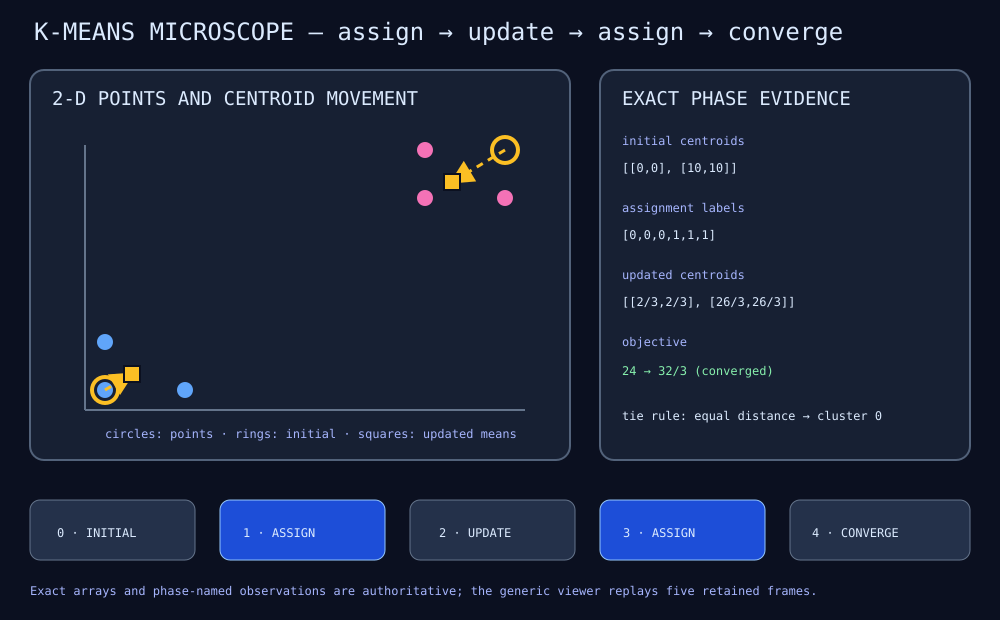

# K-means phase microscope

KM01 makes the alternating structure of two-cluster K-means explicit. Six
fixed 2-D points begin with centroids at `[0,0]` and `[10,10]`. An assignment
phase computes both squared distances, chooses labels, and totals the selected
distances. An update phase replaces each centroid with the mean of its assigned
points.

Equal distances choose cluster zero. This lower-index rule is tested directly,
so playback and repeated runs cannot change labels because of an implicit tie
choice.



## Retained timeline

The recording contains five ordered frames:

1. step 0, `kmeans/initial/*`: points and starting centroids;
2. step 1, `kmeans/assignment/*`: squared distances, labels, and objective;
3. step 2, `kmeans/update/*`: new centroids, counts, and centroid delta;
4. step 3, another assignment using the updated centroids;
5. step 4, another update whose zero delta demonstrates convergence.

Grouping is the pair `(numeric step, slash-separated observation prefix)`.
There is no algorithm-specific phase field in the version-zero recording.
The producer owns names and phase order; a generic host preserves call order,
groups the names for navigation, and renders values by shape. This fixture
therefore requires no `KMeansViewer` or K-means-specific Rust type.

The first objective is exactly `24`. After the first mean update, the labels
remain `[0,0,0,1,1,1]`, the centroids are approximately
`[[0.666667,0.666667],[8.666667,8.666667]]`, and the objective is `32/3`.

## Run and inspect

```sh
just kmeans             # execute MLPL and verify the committed SVG
just kmeans-fixture     # validate phases, shapes, values, and budgets
just kmeans-recording   # compare live SSE with the committed recording
```

Open the SVG directly or use a Markdown preview. The authoritative interactive
consumer is the offline Rust/Yew viewer in `../demo-extensions`; its next
integration should vendor producer revision
`ff15ec7da2f9055983aa72c43dfe01da92a2d4aa` and add KM01 as a third generic
fixture.

## Claim boundary

This finite example proves deterministic assignment evidence, a specified tie
policy, exact mean updates, lower objective, convergence detection, and visible
assignment/update grouping. It does not prove globally optimal initialization,
arbitrary cluster counts, empty-cluster recovery, or convergence for all data.
The checked library helpers reject malformed shapes, invalid labels, empty
clusters, and invalid update budgets rather than silently inventing behavior.
